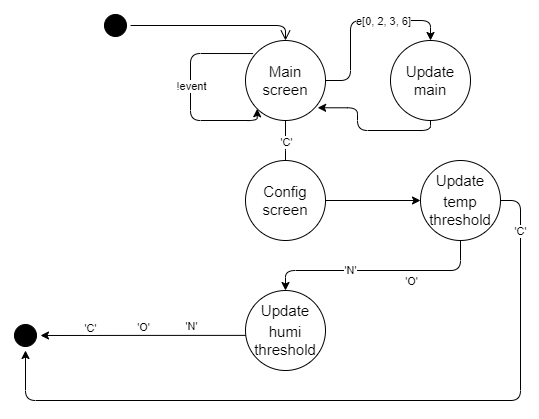

#   Smart Farming System

a real time (RTOS-based) system that enable controlling:

1 - a water pump based on the humidity sensor data.

2 - and Cooler and heater based on the temperature sensor data.

3 - also configure the threshold for both temperature and humidity in run-time by PC (terminal interfacing)

## Tasks 

the system consist of 6 tasks:

## State Machines for some tasks:

### Terminal task state machine:

### Display task state machine:

### SysCheck task state machine:

### Control task state machine:

